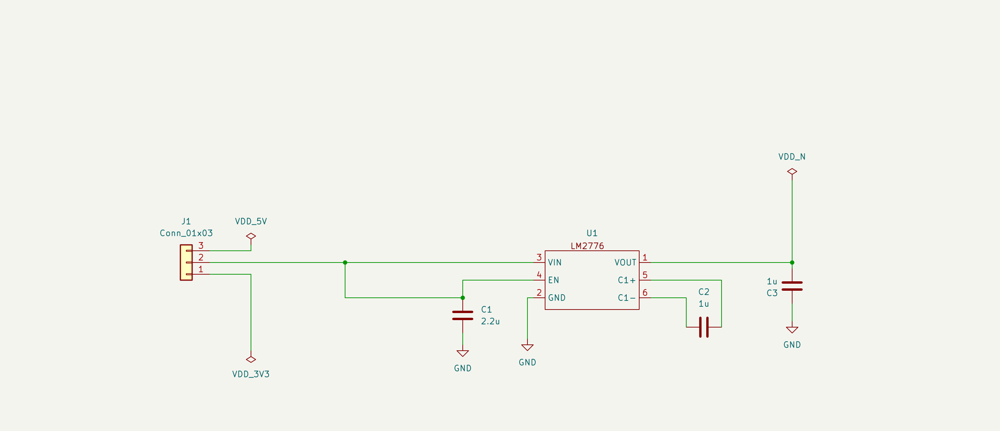
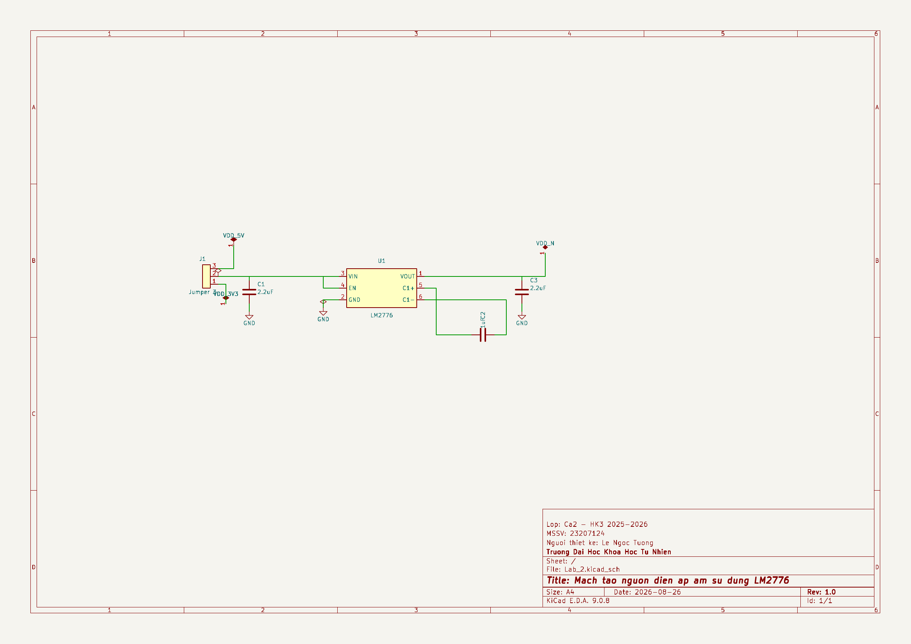
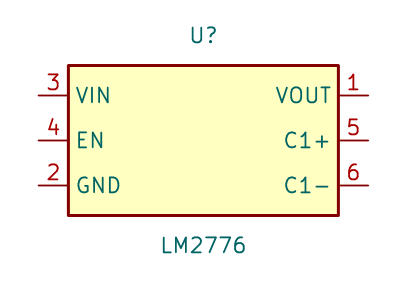
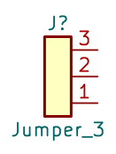
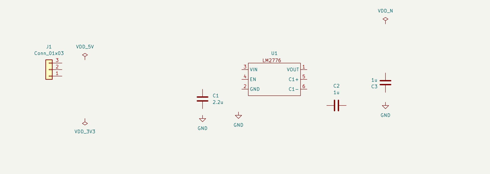
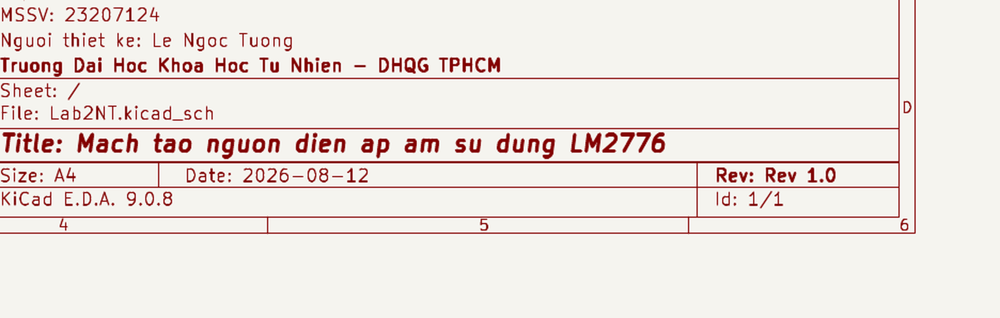
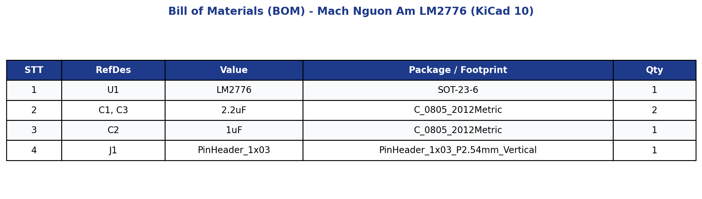

ĐẠI HỌC KHOA HỌC TỰ NHIÊN - ĐHQG TP.HCM KHOA ĐIỆN TỬ - VIỄN THÔNG

BÁO CÁO THỰC HÀNH

THIẾT KẾ MẠCH IN PCB VỚI KICAD

Lab 02: Thiết kế sơ đồ nguyên lý và Quản lý thư viện Symbol

<table class="student-info">
<tr><td>Họ và tên:</td><td><b>Lê Ngọc Tường</b></td></tr>
<tr><td>MSSV:</td><td><b>23207124</b></td></tr>
<tr><td>Lớp:</td><td><b>23DTV_CLC3</b></td></tr>
<tr><td>Môn học:</td><td><b>Thiết kế mạch in PCB với KiCad (HK3/2025-2026)</b></td></tr>
</table>

TP. HỒ CHÍ MINH, NĂM HỌC 2025 - 2026

## BÀI TẬP 1: HOÀN THÀNH TOÀN BỘ SCHEMATIC MẠCH TẠO NGUỒN ĐIỆN ÁP ÂM DÙNG LM2776

### 1. Giới thiệu tổng quan và cấu trúc mạch nguồn âm LM2776

IC LM2776 của Texas Instruments là vi mạch tạo nguồn áp âm sử dụng cơ chế bơm điện tích (Switched-Capacitor Inverter). Mạch hoạt động với tần số chuyển mạch 2 MHz, nhận điện áp vào từ +2.7V đến +5.5V và đảo thành điện áp âm từ -2.7V đến -5.5V với dòng tải tối đa 200mA.

Sơ đồ nguyên lý gồm các khối chức năng:
- **Khối nguồn vào:** Nhận nguồn +5V từ đầu cắm J1, qua tụ gốm C1 (2.2µF / 0805) để ổn định điện áp cấp cho chân VIN (chân 3) và chân kích hoạt EN (chân 4).
- **Khối bơm điện tích (Charge Pump):** Tụ bay (Flying Capacitor) C2 (1µF / 0805) gắn giữa hai chân C1+ (chân 5) và C1- (chân 6). Trong nửa chu kỳ đầu, tụ C2 nạp điện từ VIN; ở nửa chu kỳ sau, mạch đảo cực tính để truyền năng lượng sang ngõ ra.
- **Khối lọc điện áp âm ngõ ra:** Chân VOUT (chân 1) xuất điện áp âm tương ứng (-5V hoặc -3.3V tùy vị trí nối nguồn vào), qua tụ gốm C3 (2.2µF / 0805) nối mass GND để lọc phẳng điện áp cấp ra tải.

Hình 1. Sơ đồ nguyên lý hoàn chỉnh mạch tạo nguồn điện áp âm dùng IC LM2776 trên KiCad

### 2. Các bước thực hiện thiết kế sơ đồ trên KiCad Schematic Editor

#### Bước 1: Khởi động Schematic Editor và mở không gian làm việc
Mở project `Lab_2.kicad_pro` và mở file `Lab_2.kicad_sch` trong trình biên tập Schematic Editor.

Hình 2. Giao diện làm việc Schematic Editor trên KiCad

#### Bước 2: Tạo Symbol IC LM2776 và Jumper trong thư viện cá nhân
Do linh kiện LM2776 chưa có trong thư viện mặc định của đề bài, ta mở Symbol Editor (`Ctrl+Shift+L`), tạo thư viện `Lab2NT.kicad_sym` và tạo symbol LM2776 với các thông số:
- **Đóng gói:** SOT-23-6 (6 chân).
- **Cấu hình các chân (Pin) theo datasheet:**
  - Chân 1 (`OUT`): Kiểu điện học Power Output.
  - Chân 2 (`GND`): Kiểu điện học Power Input.
  - Chân 3 (`VIN`): Kiểu điện học Power Input.
  - Chân 4 (`EN`): Kiểu điện học Input.
  - Chân 5 (`C1+`): Kiểu điện học Passive.
  - Chân 6 (`C1-`): Kiểu điện học Passive.

  

    
    
Hình 3a. Symbol LM2776 tự tạo trong thư viện cá nhân

  

  

    
    
Hình 3b. Symbol Jumper_3 tự tạo trong thư viện cá nhân

  

Thư viện `Lab2NT.kicad_sym` cũng chứa các symbol nguồn `VDD_5V`, `VDD_3V3`, `VDD_N` để định danh các net nguồn trên bản vẽ.

#### Bước 3: Lấy linh kiện và đặt lên bản vẽ (Place Symbols)
Nhấn phím `A` (Add Symbol) để lấy các linh kiện đặt vào bản vẽ:
- 01 IC LM2776 (từ thư viện `Lab2NT`).
- 03 Tụ gốm C (từ thư viện `Device:C`).
- 01 Header 3 chân Jumper_3.
- Các cổng nối đất GND (phím tắt `P`).

Hình 4. Bố trí linh kiện và các cổng nguồn trước khi đi dây

#### Bước 4: Đi dây kết nối (Draw Wires)
Sử dụng phím tắt `W` (Draw Wire) để nối các chân linh kiện theo đúng sơ đồ nguyên lý mạch. Nhấn đúp chuột hoặc phím `K` để kết thúc đường dây tại các điểm nối chân.

---

## BÀI TẬP 2: KIỂM TRA TOÀN BỘ SƠ ĐỒ VÀ CHUẨN HÓA BẢN VẼ

### 1. Chuẩn hóa ký hiệu định danh tham chiếu (RefDes)

Bảng tra cứu định danh linh kiện theo tiêu chuẩn IEEE/ANSI áp dụng trong mạch:

| Ký hiệu | Tên linh kiện | Chức năng trong mạch | Linh kiện cụ thể |
|:---:|---|---|---|
| **U / IC** | Mạch tích hợp (IC) | IC đảo điện áp âm Switched-Capacitor 2MHz | U1 (LM2776, SOT-23-6) |
| **C** | Tụ điện (Capacitor) | Lọc nguồn ngõ vào, lọc ngõ ra và tụ bay charge pump | C1, C2, C3 (0805 SMD) |
| **J** | Đầu nối (Connector / Jumper) | Nhận nguồn cấp 5V và xuất nguồn âm -5V ra ngoài | J1 (Pin Header 1x03 P2.54mm) |
| **GND** | Nối đất (Ground) | Điểm tham chiếu mốc điện thế 0V chung toàn mạch | Net GND |

### 2. Tự động đánh số tham chiếu (Annotate Schematic)
Mở công cụ **Annotate Schematic** trên thanh công cụ:
- **Phạm vi:** Toàn bộ sơ đồ (Entire schematic).
- **Thứ tự:** Sort by X position (đánh số thứ tự linh kiện từ trái sang phải).
- **Quy tắc:** Gán lại nhãn để làm sạch các dấu `?` chưa định danh.

Kết quả sau khi đánh số: toàn bộ linh kiện có định danh chuẩn xác `U1`, `C1`, `C2`, `C3`, `J1` như trên Hình 1.

### 3. Kiểm tra sơ đồ bằng công cụ ERC (Electrical Rules Check)
Chạy ERC trên sơ đồ nguyên lý để phát hiện các lỗi hở chân, thiếu nguồn driving hoặc xung đột kiểu chân.

Các điểm kỹ thuật đã xử lý:
- Đặt symbol `PWR_FLAG` trên các net nguồn vào `VDD_5V`, `VDD_3V3`, net `VIN/EN` và net `GND` để thông báo cho trình kiểm tra ERC biết nguồn cấp chủ động.
- Net `VDD_N` kết nối trực tiếp với chân `VOUT` (kiểu Power Output) của U1 nên không gắn thêm `PWR_FLAG`, tránh xung đột logic hai nguồn cấp trên cùng một đường dây.
- Kết quả kiểm tra đạt 0 lỗi (0 Errors) và 0 cảnh báo (0 Warnings).

### 4. Thiết lập khung tên bản vẽ kỹ thuật (Page Settings)
Vào menu **File -> Page Settings** để điền thông tin khung tên kỹ thuật:
- Paper Size: A4 (297 x 210 mm, Landscape)
- Title: Mach tao nguon dien ap am su dung LM2776
- Revision: Rev 1.0 - Date: 2026-08-26
- Company: Truong Dai Hoc Khoa Hoc Tu Nhien - DHQG TPHCM
- Comment 1: Nguoi thiet ke: Le Ngoc Tuong
- Comment 2: MSSV: 23207124
- Comment 3: Lop: 23DTV_CLC3 - Ca thuc hanh: Ca 2

Hình 5. Khung tên bản vẽ kỹ thuật sau khi thiết lập Page Settings

---

## BÀI TẬP 3: LẬP BẢNG DANH MỤC VẬT TƯ SƠ BỘ (BILL OF MATERIALS - BOM)

Bảng tổng hợp danh mục vật tư, linh kiện điện tử và dự toán kinh phí cho mạch nguồn âm LM2776:

| STT | Ký hiệu (RefDes) | Tên linh kiện / Giá trị | Mô tả kỹ thuật | Kiểu chân (Footprint) | SL | Đơn giá (VNĐ) | Thành tiền (VNĐ) |
|:---:|:---:|---|---|---|:---:|:---:|:---:|
| 1 | U1 | LM2776DBVR | IC Switched-Capacitor Inverter -5V / 200mA, F_sw = 2MHz | SOT-23-6 | 1 | 31.000 | 31.000 |
| 2 | C1, C3 | 2.2µF / 16V | Tụ gốm dán MLCC lọc áp vào VIN và ngõ ra OUT | SMD 0805 | 2 | 800 | 1.600 |
| 3 | C2 | 1.0µF / 16V | Tụ gốm dán MLCC bơm điện tích giữa chân C1+ và C1- | SMD 0805 | 1 | 650 | 650 |
| 4 | J1 | Jumper 3 Pin | Header rào cắm đực đơn 1x3 chân thẳng bước 2.54mm | THT 1x03 P2.54mm | 1 | 800 | 800 |
| 5 | PCB | Mạch in 2 lớp | Bo mạch in FR-4, dày 1.6mm, kích thước 22x13mm | 2 Lớp (Top/Bottom) | 1 | 25.000 | 25.000 |
| **TỔNG CỘNG** | | | **TỔNG KINH PHÍ DỰ TOÁN CHO 01 MẠCH HOÀN CHỈNH** | | **5 linh kiện** | | **59.050 VNĐ** |

Hình 6. Danh mục vật tư và linh kiện sơ bộ xuất từ dự án KiCad (Lab2_BOM.csv)

