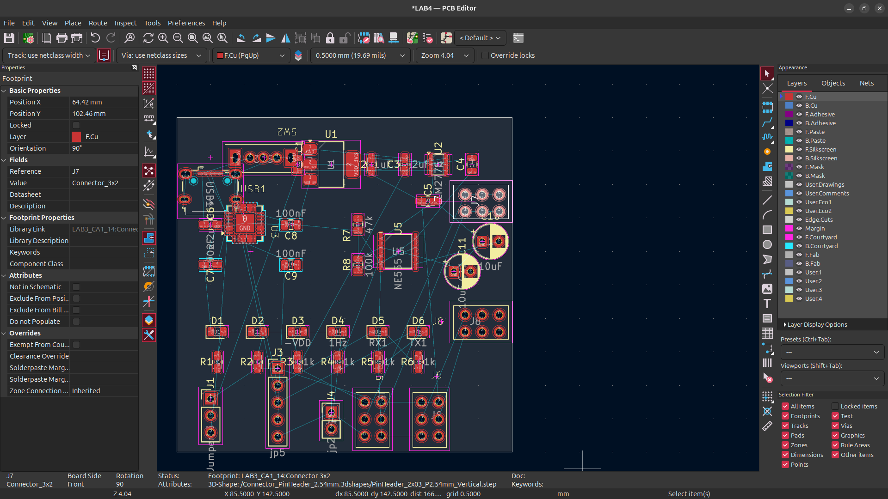
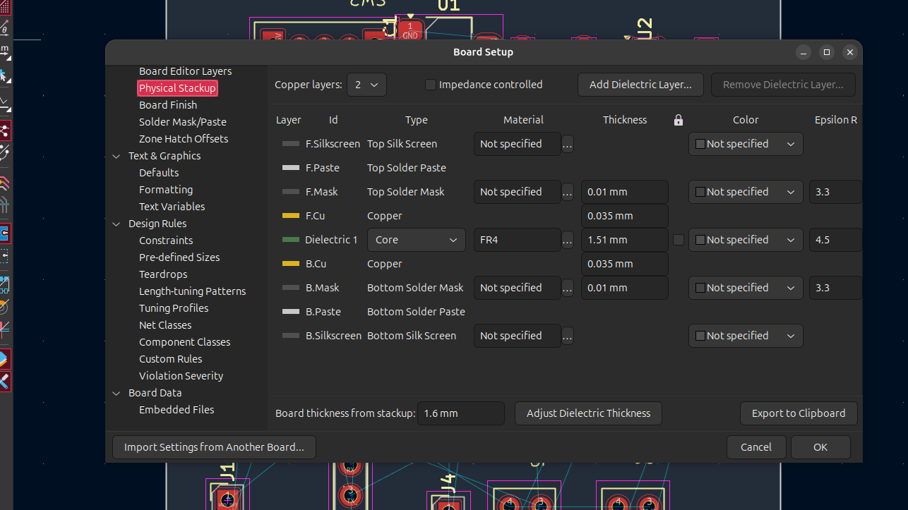
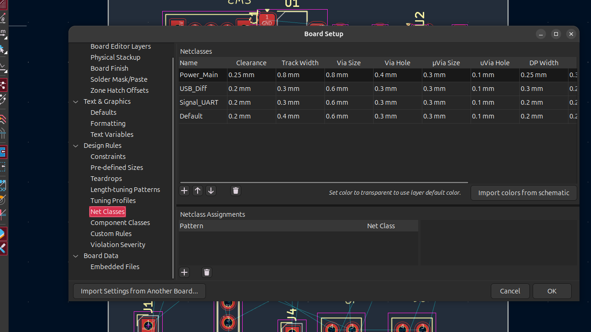
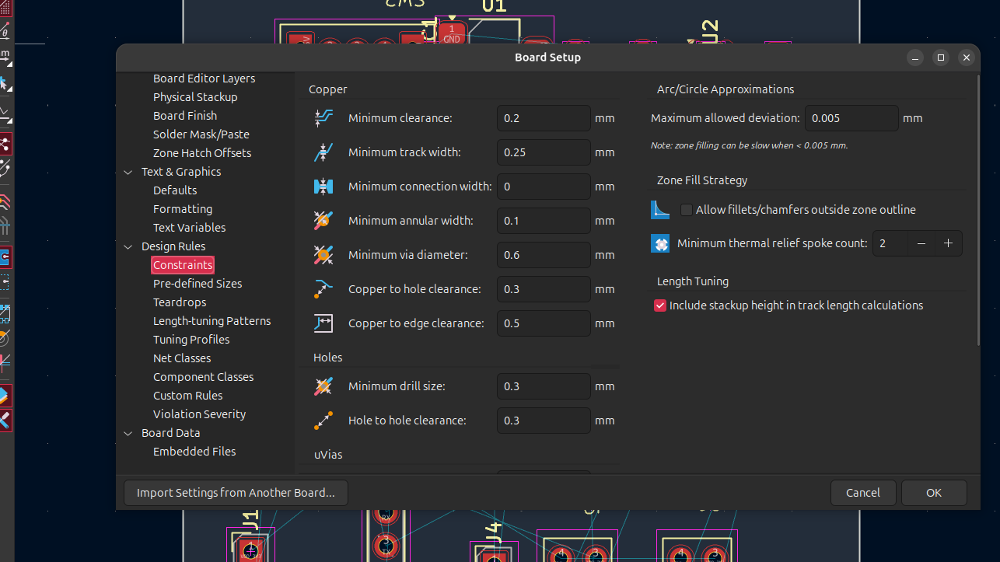
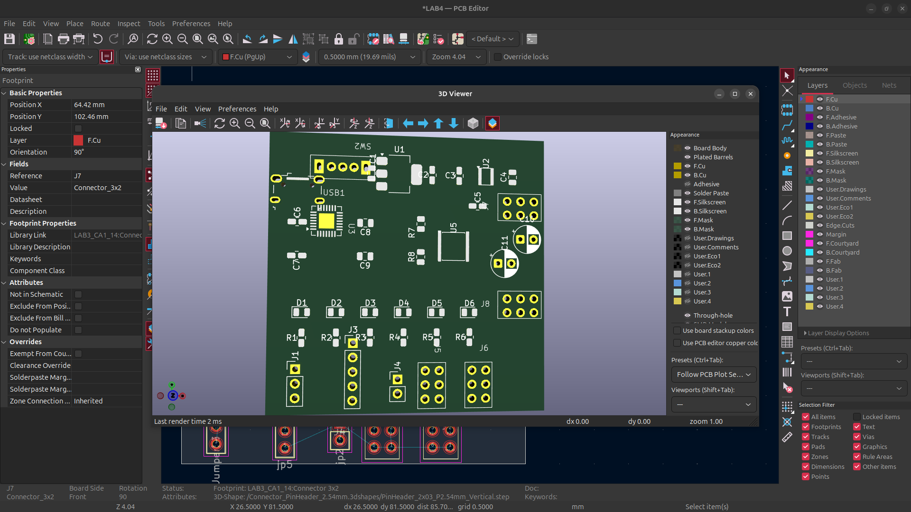
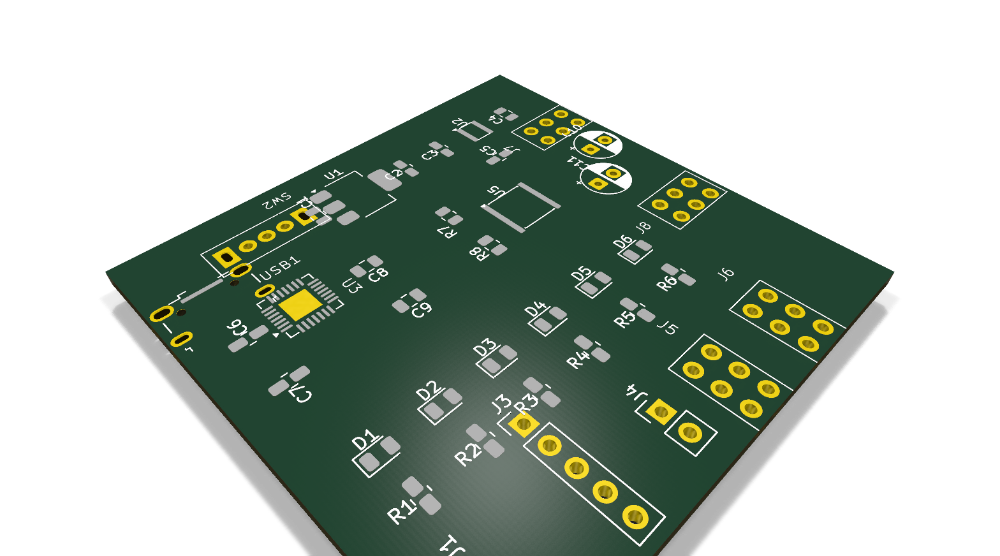

    

        
ĐẠI HỌC KHOA HỌC TỰ NHIÊN - ĐHQG TP.HCM KHOA ĐIỆN TỬ - VIỄN THÔNG

        

    

    
    

        
BÁO CÁO THỰC HÀNH

        
THIẾT KẾ MẠCH IN PCB VỚI KICAD

        
Lab 04: Thiết lập PCB, Cấu hình Board Outline, Stackup, Design Rules và Net Classes

    

    
    

        <table class="student-info">
            <tr>
                <td>Họ và tên:</td>
                <td>Lê Ngọc Tường</td>
            </tr>
            <tr>
                <td>MSSV:</td>
                <td>23207124</td>
            </tr>
            <tr>
                <td>Lớp:</td>
                <td>23DTV_CLC3</td>
            </tr>
            <tr>
                <td>Môn học:</td>
                <td>Thiết kế mạch in PCB với KiCad (HK3/2025-2026)</td>
            </tr>
        </table>
    

    
    

        TP. HỒ CHÍ MINH, NĂM HỌC 2025 - 2026
    

## CÂU 1: HOÀN THÀNH ĐẦY ĐỦ CÁC BƯỚC THIẾT LẬP PCB CHO MẠCH NGUỒN ĐA NĂNG

Mục tiêu của bài tập là chuyển đổi toàn bộ sơ đồ nguyên lý mạch nguồn đa năng từ Schematic sang PCB Editor, thiết lập khung viền cơ khí bo mạch, cấu hình cấu trúc lớp vật lý (Physical Stackup) và phân loại các nhóm mạng (Net Classes).

### 1.1. Đồng bộ dữ liệu Schematic sang PCB Editor (Update PCB from Schematic)

* **Thao tác thực hiện:** Trong giao diện PCB Editor, mở menu `Tools -> Update PCB from Schematic...` (phím tắt `F8`).
* **Kiểm tra trạng thái:** Hộp thoại hiển thị danh sách toàn bộ footprint và mạng kết nối (netlist). Quá trình kiểm tra đạt `Total warnings: 0, errors: 0`, xác nhận không có xung đột hay thiếu footprint. Bấm **Update PCB** để nạp linh kiện vào vùng làm việc.

### 1.2. Thiết lập đường bao bo mạch trên lớp Edge.Cuts (Board Outline)

* **Nguyên tắc kỹ thuật:** Lớp `Edge.Cuts` xác định biên dạng cắt thực tế của bo mạch. Đường bao trên lớp này phải tạo thành một đa giác khép kín hoàn toàn và không tự giao cắt.
* **Các bước thực hiện:**
  1. Chuyển bước lưới (Grid) về giá trị 1.0 mm hoặc 0.5 mm để căn chỉnh kích thước chuẩn xác.
  2. Chọn lớp hoạt động là **`Edge.Cuts`** trên bảng điều khiển Appearance.
  3. Dùng công cụ *Draw Rectangle*, vẽ đường bao bo mạch kích thước 50 x 50 mm bao quanh toàn bộ linh kiện đã sắp xếp của mạch nguồn.

    
    
Hình 1. Giao diện KiCad PCB Editor sau khi hoàn tất đồng bộ từ Schematic, vẽ đường bao cơ khí Edge.Cuts và hiển thị đường nối mạng (Ratsnest)

### 1.3. Cấu hình cấu trúc lớp bo mạch (Physical Stackup)

Vào `File -> Board Setup... -> Board Stackup -> Physical Stackup` để cấu hình cấu trúc lớp vật lý cho mạch nguồn:

* **Số lớp đồng (Copper Layers):** Chọn cấu hình **2 lớp** (`F.Cu` và `B.Cu`), đáp ứng hoàn toàn nhu cầu truyền dẫn dòng và tín hiệu, tối ưu chi phí gia công.
* **Vật liệu lõi cách điện:** Chuẩn công nghiệp **FR4** với hằng số điện môi xấp xỉ 4.5.

<table class="report-table">
    <thead>
        <tr>
            <th style="width: 8%;">STT</th>
            <th style="width: 25%;">Thành phần lớp</th>
            <th style="width: 22%;">Tên lớp trong KiCad</th>
            <th style="width: 18%;">Độ dày</th>
            <th style="width: 27%;">Chức năng kỹ thuật</th>
        </tr>
    </thead>
    <tbody>
        <tr>
            <td style="text-align: center;">1</td>
            <td>Lớp phủ bảo vệ mặt trên</td>
            <td><code>Top Solder Mask</code></td>
            <td>0.010 mm (10 µm)</td>
            <td>Chống oxy hóa đồng, mở lỗ pad hàn</td>
        </tr>
        <tr>
            <td style="text-align: center;">2</td>
            <td>Lớp đồng mặt trước</td>
            <td><code>F.Cu (Front Copper)</code></td>
            <td>0.035 mm (1 oz Cu)</td>
            <td>Đi dây tín hiệu, đặt linh kiện SMD</td>
        </tr>
        <tr>
            <td style="text-align: center;">3</td>
            <td>Lõi cách điện trung tâm</td>
            <td><code>Dielectric Core (FR4)</code></td>
            <td>1.510 mm</td>
            <td>Cách điện và định hình cơ học bo mạch</td>
        </tr>
        <tr>
            <td style="text-align: center;">4</td>
            <td>Lớp đồng mặt sau</td>
            <td><code>B.Cu (Back Copper)</code></td>
            <td>0.035 mm (1 oz Cu)</td>
            <td>Đi dây nguồn, phủ đồng mặt phẳng mass (GND)</td>
        </tr>
        <tr>
            <td style="text-align: center;">5</td>
            <td>Lớp phủ bảo vệ mặt dưới</td>
            <td><code>Bottom Solder Mask</code></td>
            <td>0.010 mm (10 µm)</td>
            <td>Chống chạm chập mặt dưới khi hàn</td>
        </tr>
        <tr>
            <td colspan="3" style="text-align: right; font-weight: bold;">Tổng độ dày bo mạch:</td>
            <td style="font-weight: bold;">1.600 mm</td>
            <td style="font-weight: bold;">Độ dày tiêu chuẩn mạch FR-4 2 lớp</td>
        </tr>
    </tbody>
</table>

    
    
Hình 2. Giao diện cấu hình cấu trúc lớp bo mạch Physical Stackup (2 lớp đồng, lõi FR4, tổng độ dày 1.6 mm)

### 1.4. Phân nhóm và cấu hình lớp mạng (Net Classes)

Net Class quản lý luật thiết kế theo từng nhóm mạng điện, cho phép tự động áp dụng bề rộng đường mạch (*Track Width*), khoảng cách cách ly (*Clearance*) và kích thước lỗ via (*Via Size*) phù hợp cho từng loại tín hiệu:

* **Nhóm nguồn tải lớn (`Power_Main`):** Gồm `VBUS`, `+5V`, `+3.3V`, `-5V` và `GND`. Bề rộng track đặt 0.80 mm để giảm nội trở đường dây, hạn chế sụt áp và chịu dòng tải tốt.
* **Nhóm tín hiệu vi sai USB (`USB_Diff`):** Gồm cặp net `D+` và `D-` từ cổng Micro-USB. Bề rộng track 0.30 mm và khoảng cách vi sai 0.20 mm để phối hợp trở kháng đường truyền.
* **Nhóm tín hiệu UART và xung clock (`Signal_UART`):** Gồm `TXD`, `RXD`, `RTS`, `CTS`, `DTR` và `CLK_555`. Bề rộng track 0.30 mm để đường mạch gọn gàng và dễ layout.
* **Nhóm tín hiệu mặc định (`Default`):** Áp dụng cho các đường tín hiệu điều khiển còn lại với bề rộng track 0.40 mm.

Vào `File -> Board Setup... -> Design Rules -> Net Classes` để thiết lập các nhóm lớp mạng:

<table class="report-table">
    <thead>
        <tr>
            <th style="width: 15%;">Tên Net Class</th>
            <th style="width: 12%;">Clearance</th>
            <th style="width: 14%;">Track Width</th>
            <th style="width: 13%;">Via Diameter</th>
            <th style="width: 12%;">Via Drill</th>
            <th style="width: 34%;">Danh sách các Net được gán</th>
        </tr>
    </thead>
    <tbody>
        <tr>
            <td><strong><code>Default</code></strong></td>
            <td>0.20 mm</td>
            <td>0.40 mm</td>
            <td>0.60 mm</td>
            <td>0.30 mm</td>
            <td>Các net tín hiệu chưa phân lớp riêng</td>
        </tr>
        <tr>
            <td><strong><code>Power_Main</code></strong></td>
            <td>0.25 mm</td>
            <td><strong>0.80 mm</strong></td>
            <td><strong>0.80 mm</strong></td>
            <td><strong>0.40 mm</strong></td>
            <td><code>VBUS</code>, <code>+5V</code>, <code>+3.3V</code>, <code>-5V</code>, <code>GND</code></td>
        </tr>
        <tr>
            <td><strong><code>USB_Diff</code></strong></td>
            <td>0.20 mm</td>
            <td><strong>0.30 mm</strong></td>
            <td>0.60 mm</td>
            <td>0.30 mm</td>
            <td>Cặp tín hiệu vi sai <code>D+</code>, <code>D-</code></td>
        </tr>
        <tr>
            <td><strong><code>Signal_UART</code></strong></td>
            <td>0.20 mm</td>
            <td><strong>0.30 mm</strong></td>
            <td>0.60 mm</td>
            <td>0.30 mm</td>
            <td><code>TXD</code>, <code>RXD</code>, <code>RTS</code>, <code>CTS</code>, <code>DTR</code>, <code>CLK_555</code></td>
        </tr>
    </tbody>
</table>

    
    
Hình 3. Giao diện phân loại và cấu hình thông số kỹ thuật cho các nhóm Net Classes trong KiCad

## CÂU 2: THIẾT LẬP LẠI DESIGN RULES THEO CHUẨN NHÀ SẢN XUẤT PCB DỰ KIẾN

Thay vì sử dụng các giá trị mặc định của KiCad (thường quá chặt hoặc chưa phù hợp với năng lực sản xuất thực tế dẫn đến tăng chi phí hoặc lỗi DFM), các thông số ràng buộc thiết kế (*Design Rules Constraints*) được cấu hình lại theo đúng thông số công bố của nhà sản xuất PCB tiêu chuẩn (JLCPCB / PCBWay 2-layer standard process).

Vào `File -> Board Setup... -> Design Rules -> Constraints` để thiết lập các giới hạn kích thước tối thiểu:

<table class="report-table">
    <thead>
        <tr>
            <th style="width: 28%;">Thông số ràng buộc</th>
            <th style="width: 18%;">Mặc định KiCad</th>
            <th style="width: 20%;">Chuẩn xưởng gia công</th>
            <th style="width: 34%;">Ý nghĩa kỹ thuật</th>
        </tr>
    </thead>
    <tbody>
        <tr>
            <td><strong>Minimum clearance</strong></td>
            <td>0.00 mm</td>
            <td><strong>0.20 mm</strong> (8 mil)</td>
            <td>Khoảng cách an toàn giữa hai đường đồng khác net</td>
        </tr>
        <tr>
            <td><strong>Minimum track width</strong></td>
            <td>0.20 mm</td>
            <td><strong>0.25 mm</strong> (10 mil)</td>
            <td>Bề rộng nhỏ nhất của đường mạch, tránh đứt khi ăn mòn</td>
        </tr>
        <tr>
            <td><strong>Minimum via diameter</strong></td>
            <td>0.50 mm</td>
            <td><strong>0.60 mm</strong> (24 mil)</td>
            <td>Đường kính vòng khuyên ngoài nhỏ nhất của lỗ via</td>
        </tr>
        <tr>
            <td><strong>Minimum via drill size</strong></td>
            <td>0.30 mm</td>
            <td><strong>0.30 mm</strong> (12 mil)</td>
            <td>Đường kính mũi khoan nhỏ nhất của via chuyển lớp</td>
        </tr>
        <tr>
            <td><strong>Copper to hole clearance</strong></td>
            <td>0.25 mm</td>
            <td><strong>0.30 mm</strong> (12 mil)</td>
            <td>Khoảng cách từ mép đường đồng đến mép lỗ khoan</td>
        </tr>
        <tr>
            <td><strong>Copper to edge clearance</strong></td>
            <td>0.50 mm</td>
            <td><strong>0.50 mm</strong> (20 mil)</td>
            <td>Khoảng cách từ đường đồng đến đường cắt viền bo Edge.Cuts</td>
        </tr>
        <tr>
            <td><strong>Hole to hole clearance</strong></td>
            <td>0.25 mm</td>
            <td><strong>0.30 mm</strong> (12 mil)</td>
            <td>Khoảng cách giữa hai mép lỗ khoan để tránh nứt phôi FR4</td>
        </tr>
    </tbody>
</table>

    
    
Hình 4. Giao diện thiết lập ràng buộc luật thiết kế Constraints theo thông số xưởng sản xuất

### KIỂM TRA MÔ HÌNH 3D VÀ ĐÁNH GIÁ TRỰC QUAN BO MẠCH

Sau khi hoàn tất toàn bộ các bước thiết lập trong Bài tập về nhà (đồng bộ Schematic, vẽ Board Outline, cấu hình Layer Stackup, Design Rules và Net Classes), mô hình 3D của bo mạch được mở và kiểm tra trực quan bằng công cụ **3D Viewer** tích hợp trong KiCad (`Alt + 3`).

    
    
Hình 5. Cửa sổ công cụ 3D Viewer trong KiCad kiểm tra hình học và sự phân bố linh kiện trên khung viền cơ khí

    
    
Hình 6. Mô hình 3D góc phối cảnh Isometric toàn bo mạch nguồn đa năng sau khi hoàn thiện toàn bộ thiết lập

