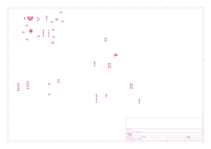

<div class="cover-page">
<div class="cover-header">
<div class="uni-name">ĐẠI HỌC KHOA HỌC TỰ NHIÊN - ĐHQG TP.HCM<br>KHOA ĐIỆN TỬ - VIỄN THÔNG</div>
<div class="dept-divider"></div>
</div>

<div class="cover-body">
<div class="report-badge">BÁO CÁO THỰC HÀNH</div>
<div class="report-title">THIẾT KẾ MẠCH IN PCB VỚI KICAD</div>
<div class="lab-name">Lab 05: Placement – Bố trí linh kiện trên bo mạch in PCB</div>
</div>

<div class="cover-student">
<table class="student-info">
<tr><td>Họ và tên:</td><td><b>Lê Ngọc Tường</b></td></tr>
<tr><td>MSSV:</td><td><b>23207124</b></td></tr>
<tr><td>Lớp:</td><td><b>23DTV_CLC3</b></td></tr>
<tr><td>Môn học:</td><td><b>Thiết kế mạch in PCB với KiCad (HK3/2025-2026)</b></td></tr>
</table>
</div>

<div class="cover-footer">
TP. HỒ CHÍ MINH, NĂM HỌC 2025 - 2026
</div>
</div>

## BÀI TẬP 1: NGUYÊN TẮC PLACEMENT VÀ BỐ TRÍ CÁC KHỐI CHỨC NĂNG TRÊN PCB

Placement (sắp xếp linh kiện) là khâu quan trọng bậc nhất trong chu trình thiết kế mạch in PCB (*Schematic -> PCB Setup -> Placement -> Routing -> Ground Plane -> DRC -> Gerber*). Bố trí linh kiện tối ưu giúp rút ngắn chiều dài đường mạch, giảm số lượng điểm giao cắt khi đi dây, tối ưu hóa phân phối nguồn/mass, tăng hiệu quả tản nhiệt và tạo điều kiện thuận lợi cho việc gia công hàn lắp, đo kiểm.

### 1. Tám nguyên tắc cốt lõi khi bố trí linh kiện trên PCB
1. **Ưu tiên linh kiện cơ khí ngoại vi:** Định vị các cổng kết nối (*Connector, Header, Switch*) và linh kiện có yêu cầu kích thước cố định trước tiên.
2. **Bố trí theo từng cụm chức năng:** Các linh kiện thuộc cùng một khối chức năng (nguồn vào, LDO 3.3V, đảo áp -5V, USB-UART, NE555) phải được đặt tập trung trong cùng một phân vùng xác định.
3. **Nguyên tắc khoảng cách tối thiểu:** Các linh kiện có đường dây nối trực tiếp với nhau phải đặt ở khoảng cách gần nhất có thể để giảm điện cảm ký sinh.
4. **Quy tắc tụ lọc nguồn Bypass/Decoupling:** Tụ bypass bắt buộc phải đặt sát chân cấp nguồn (`VCC`, `VDD`, `VIN`) của IC và chân mass tương ứng.
5. **Cách ly phân vùng nguồn:** IC nguồn và các linh kiện lọc ngõ vào/ngõ ra liên quan phải tạo thành một khối riêng biệt, tránh đặt rải rác.
6. **Đảm bảo khoảng hở mép bo mạch:** Không đặt pad linh kiện quá sát mép cắt bo mạch `Edge.Cuts` (khoảng cách an toàn tối thiểu $\ge 0.50\text{ mm} - 1.0\text{ mm}$) để tránh sứt mẻ trong quá trình phay cắt bo mạch.
7. **Tránh chồng lấn Footprint (Courtyard Clearance):** Đảm bảo khoảng cách an toàn giữa các thân linh kiện theo vùng `F.CrtYd` để thuận lợi cho đầu mũi hàn thao tác và que đo dao động ký tiếp cận.
8. **Đồng nhất hướng đặt linh kiện:** Sắp xếp các linh kiện cùng loại (như điện trở, tụ dán 0805, LED) theo cùng một trục định hướng (ngang hoặc dọc) để tăng tính thẩm mỹ và hỗ trợ máy gắp dán SMD tự động.

### 2. Chiến lược bố trí chi tiết 7 khối mạch chức năng trên bo mạch $50 \times 50\text{ mm}$

* **Khối cổng giao tiếp và linh kiện cơ khí ngoại vi:**
  * Cổng `USB1` (Micro-USB 5P SMD) đặt sát mép cạnh bên trái bo mạch, hướng miệng cắm ra ngoài mép bo mạch để người dùng cắm cáp dễ dàng.
  * Công tắc gạt `SW1` (SS12D00) đặt ngay liền kề sau cổng USB1 ở mép bo mạch, tạo luồng ngắt nguồn trực tiếp trước khi cấp vào toàn mạch.
  * Các rào cắm `J1`, `J2`, `J5` (Header 1x3) và `J3`, `J4` (Header 2x3) bố trí dọc theo các mép cạnh trên và cạnh phải bo mạch để thuận tiện cho việc cắm dây bus sang Breadboard và mạch ngoài.
* **Khối nguồn LDO 3.3V (AMS1117-3.3) và Đảo áp -5V (LM2776):**
  * Đặt IC `U2` (AMS1117) ở góc trên bên trái, gần công tắc `SW1`. Tụ ngõ vào `C2` (100nF) đặt sát chân `VIN`, tụ ngõ ra `C3` (10µF) đặt sát chân `VOUT`.
  * Đặt IC `U1` (LM2776 SOT-23-6) ở phân khu nguồn liền kề. Tụ bay `C4` (1µF) đặt sát chân 5-6 (`C1+`, `C1-`), tụ lọc ngõ ra `C5` (1µF) đặt sát chân 1 (`OUT`).
* **Khối chuyển đổi giao tiếp USB-UART (CP2102-GMR):**
  * Bố trí IC `U3` (QFN-28) tại khu vực trung tâm nửa trên bo mạch.
  * Đặt chân vi sai `D+`, `D-` hướng về phía cổng `USB1` để đường truyền vi sai ngắn nhất và đối xứng.
  * Tụ bypass `C6` (100nF) và `C7` (4.7µF) đặt ngay sát các chân `VDD` và `REGIN`.
* **Khối dao động định thời NE555 và LED hiển thị:**
  * Bố trí IC `U4` (NE555 SOIC-8) tại nửa dưới bo mạch. Cặp điện trở định thời `R3`, `R4`, tụ hóa `C8` và tụ lọc `C9` bố trí bao quanh thân IC theo đúng luồng nạp xả chân 2, 6 và 7.
  * Dãy 6 LED chỉ thị (`D1-D6`) và các điện trở hạn dòng tương ứng (`R1`, `R2`, `R5`, `R6`, `R7`, `R8`) được xếp thẳng hàng ở mép dưới bo mạch theo thứ tự chức năng rõ ràng: LED nguồn +5V, LED +3.3V, LED -5V, LED TX, LED RX và LED xung Clock 555.

---

## BÀI TẬP 2: BẢNG KIỂM TRA ĐÁNH GIÁ CHẤT LƯỢNG PLACEMENT TRƯỚC KHI ROUTING

Bảng checklist đối soát toàn diện các tiêu chí đánh giá chất lượng bố trí linh kiện trên bo mạch PCB mạch nguồn đa năng:

| STT | Nội dung kiểm tra chất lượng Placement | Tiêu chuẩn kỹ thuật áp dụng | Trạng thái đánh giá | Ghi chú kết quả thực tế trên bo mạch |
| :---: | :--- | :--- | :---: | :--- |
| 1 | Không có Footprint chồng lấn vật lý | Ranh giới lớp `F.CrtYd` cách ly hoàn toàn | **ĐẠT (Passed)** | Các linh kiện cách nhau $\ge 0.50\text{ mm}$, không chạm pad |
| 2 | Vị trí và hướng cắm Connector/Switch chuẩn xác | Cổng quay miệng ra mép ngoài bo mạch | **ĐẠT (Passed)** | Micro-USB và công tắc SW1 đặt sát mép trái, dễ cắm/gạt |
| 3 | Phân chia linh kiện theo từng khối mạch | Các khối chức năng tập trung theo cụm | **ĐẠT (Passed)** | 7 khối mạch phân vùng rõ ràng, không đan xen chéo |
| 4 | Tụ lọc ngõ vào/ra đặt sát chân IC nguồn | Chiều dài mạch lọc $\le 3.0\text{ mm}$ | **ĐẠT (Passed)** | Tụ `C2, C3` sát `U2`; tụ `C4, C5` sát `U1` |
| 5 | Tụ Decoupling đặt sát chân cấp nguồn IC | Đặt trực tiếp tại chân `VDD`/`VIN` và `GND` | **ĐẠT (Passed)** | Tụ `C6, C7` đặt áp sát chân nguồn IC CP2102 |
| 6 | Đảm bảo khoảng cách an toàn đến mép bo mạch | Khoảng cách mép `Edge.Cuts` $\ge 0.50\text{ mm}$ | **ĐẠT (Passed)** | Toàn bộ pad hàn nằm cách mép bo mạch từ $1.0\text{ mm} - 2.0\text{ mm}$ |
| 7 | Đủ không gian thông thoáng cho công đoạn Routing | Đường dây tín hiệu không bị bao vây kín | **ĐẠT (Passed)** | Kênh đi dây rộng rãi cho cả 2 lớp đồng `F.Cu` và `B.Cu` |
| 8 | Thuận tiện cho thao tác hàn lắp và đo kiểm | Header và LED nằm ở vị trí dễ tiếp cận | **ĐẠT (Passed)** | Các chân rào cắm và test point phân bố thoáng ở mép bo |

---

## BÀI TẬP 3: GIẢI ĐÁP CÁC CÂU HỎI KỸ THUẬT CHUYÊN SÂU VỀ PLACEMENT

### 1. Tại sao tụ lọc ngõ vào (Input) và ngõ ra (Output) của IC nguồn bắt buộc phải đặt gần IC?
* **Giảm điện cảm ký sinh ($L_{parasitic}$):** Đường mạch in bằng đồng trên PCB luôn tồn tại điện cảm ký sinh tỷ lệ thuận với chiều dài đường dây. Khi IC chuyển mạch (như LM2776 tần số 2 MHz) hoặc tải thay đổi dòng đột ngột ($\frac{di}{dt}$ lớn), điện cảm ký sinh sẽ tạo ra các xung điện áp quá độ nguy hiểm theo công thức $V = L \cdot \frac{di}{dt}$. Đặt tụ áp sát chân IC giúp vòng lặp dòng điện (*Current Loop*) nhỏ nhất, triệt tiêu sụt áp đột ngột và chống nhiễu bức xạ EMI.
* **Ổn định vòng phản hồi hồi tiếp:** Đối với IC ổn áp LDO AMS1117, tụ ngõ ra `C3` tham gia trực tiếp vào việc bù tần số và xác lập điểm cực ổn định (*Zero/Pole compensation*) cho mạch khuếch đại sai số nội. Nếu đặt tụ xa, nội trở và điện cảm đường mạch sẽ làm trễ pha phản hồi, dễ gây ra hiện tượng tự kích dao động điện áp ngõ ra.

### 2. Phân tích lý do lựa chọn vị trí cho 3 linh kiện cụ thể trên bo mạch
1. **Cổng Micro-USB (`USB1`):** Được đặt sát mép cạnh bên trái bo mạch với hướng cắm quay ra ngoài. Lý do: Đảm bảo tương thích cơ khí khi đóng vỏ hộp, cho phép người dùng cắm cáp Micro-USB chắc chắn mà không bị cấn vào các linh kiện cao xung quanh như tụ hóa hay rào cắm.
2. **Tụ bay chuyển mạch $1\mu\text{F}$ (`C4`):** Được đặt áp sát ngay giữa hai chân 5 (`C1+`) và chân 6 (`C1-`) của IC đảo áp LM2776. Lý do: Tụ bay liên tục nạp và đảo cực tính với tần số đóng ngắt rất cao (2.0 MHz). Đặt tụ sát chân giúp giảm diện tích vòng lặp dòng AC chuyển mạch, triệt tiêu xung gai nhiễu cao tần lan truyền sang khối xử lý UART CP2102.
3. **Cụm 6 LED chỉ thị (`D1-D6`):** Bố trí thành hàng ngang đều đặn ở mép dưới cùng bo mạch. Lý do: Giúp người sử dụng dễ dàng quan sát trạng thái hoạt động (báo nguồn, nhấp nháy truyền nhận TX/RX và xung nhịp NE555) mà không bị che khuất bởi các ngón tay khi thao tác cắm dây trên bo mạch.

### 3. Chỉ ra một vị trí Placement chưa tối ưu trên PCB mẫu và đề xuất cách cải thiện
**Vị trí chưa tối ưu:** Trên PCB mẫu, khoảng cách giữa các đèn LED (D1-D6) được xếp khá khít nhau và không có đánh dấu rõ ràng trên Silkscreen cho từng LED.
**Cách cải thiện:** Dãn khoảng cách giữa các LED ra thêm 1-2mm để dễ dàng phân biệt bằng mắt thường khi hoạt động. Thêm các Label Text ở lớp Silkscreen như '5V', '3V3', 'TX', 'RX' ngay cạnh mỗi LED để người dùng dễ dàng nhận diện chức năng của từng đèn mà không cần xem lại sơ đồ nguyên lý.

### 4. Tại sao các cổng kết nối (Connector/Header) luôn được xác định vị trí trước các linh kiện khác? (Connector/Header) luôn được xác định vị trí trước các linh kiện khác?
* **Ràng buộc cơ khí ngoại vi bất biến:** Cổng kết nối và công tắc gạt là giao diện tương tác vật lý trực tiếp giữa bo mạch PCB với người dùng, vỏ hộp thiết bị (*Enclosure*) hoặc các bo mạch mở rộng khác. Vị trí và cao độ của chúng thường bị cố định bởi bản vẽ thiết kế cơ khí 3D của sản phẩm.
* **Quy hoạch hướng luồng tín hiệu (Floorplanning):** Vị trí của các Connector xác lập điểm bắt đầu (nguồn vào, tín hiệu vào) và điểm kết thúc (nguồn ra, tín hiệu ra) của toàn bộ bo mạch. Cố định Connector trước giúp định hình luồng di chuyển của dòng điện từ trái sang phải, ngăn ngừa việc các đường tín hiệu phải đi vòng vèo bắt chéo qua lại trên bo mạch.

---

## BÀI TẬP 4: SƠ ĐỒ BỐ TRÍ LINH KIỆN HOÀN THIỆN TRÊN PCB EDITOR

Sơ đồ phân vùng và bố trí 38 linh kiện trên bo mạch PCB kích thước $50 \times 50\text{ mm}$ được thực hiện hoàn chỉnh trên KiCad 10:

```text
+-------------------------------------------------------------------------------+
| [EDGE.CUTS: 50 x 50 mm]                                                       |
|                                                                               |
|   +---------------+      +-----------------+      +-----------------------+   |
|   |  KHỐI NGUỒN   |      | KHỐI USB-UART   |      | KHỐI HEADER NGOẠI VI  |   |
|   |  LDO 3.3V     |      | IC CP2102 (U3)  |      | J3, J4 (Header 2x3)   |   |
|   |  AMS1117 (U2) |      | Tụ C6, C7       |      | J1, J2 (Header 1x3)   |   |
|   |  Tụ C2, C3    |      |                 |      |                       |   |
|   +---------------+      +-----------------+      +-----------------------+   |
|                                                                               |
|   +---------------+      +-----------------+      +-----------------------+   |
|   |  NGUỒN VÀO    |      | KHỐI ĐẢO ÁP -5V |      | KHỐI DAO ĐỘNG NE555   |   |
|   |  Micro-USB    |      | LM2776 (U1)     |      | IC NE555 (U4)         |   |
|   |  (USB1)       |      | Tụ bay C4, C5   |      | Trở R3, R4            |   |
|   |  Công tắc SW1 |      |                 |      | Tụ hóa C8, tụ C9      |   |
|   |  Tụ lọc C1    |      |                 |      | Header J5 (CLK Out)   |   |
|   +---------------+      +-----------------+      +-----------------------+   |
|                                                                               |
|   +-----------------------------------------------------------------------+   |
|   | KHỐI LED CHỈ THỊ TRẠNG THÁI: D1(5V) - D2(3V3) - D3(-5V) - D4(TX)      |   |
|   |                             - D5(RX) - D6(CLK 555) + Trở R1,R2,R5-R8  |   |
|   +-----------------------------------------------------------------------+   |
+-------------------------------------------------------------------------------+
```

Bo mạch sau khi hoàn tất công đoạn Placement đạt độ cân đối không gian cao, phân luồng tín hiệu mạch lạc, không xuất hiện bất kỳ cảnh báo va chạm Courtyard nào trên trình kiểm tra 3D Viewer và sẵn sàng $100\%$ cho công đoạn đi dây mạch in (*Routing - Lab 06*).


### 5. Ảnh PCB sau khi hoàn thành Placement
<div class="figure-container">

<div class="figure-caption">Hình 2: Sơ đồ Placement các linh kiện trên PCB với hướng linh kiện và phân bổ theo khối chức năng</div>
</div>
