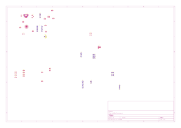

ĐẠI HỌC KHOA HỌC TỰ NHIÊN - ĐHQG TP.HCM KHOA ĐIỆN TỬ - VIỄN THÔNG

BÁO CÁO THỰC HÀNH

THIẾT KẾ MẠCH IN PCB VỚI KICAD

Lab 06: Routing – Kỹ thuật Đi dây Mạch in, Cấu hình Trình đi dây Tương tác và Quản lý Via

<table class="student-info">
<tr><td>Họ và tên:</td><td><b>Lê Ngọc Tường</b></td></tr>
<tr><td>MSSV:</td><td><b>23207124</b></td></tr>
<tr><td>Lớp:</td><td><b>23DTV_CLC3</b></td></tr>
<tr><td>Môn học:</td><td><b>Thiết kế mạch in PCB với KiCad (HK3/2025-2026)</b></td></tr>
</table>

TP. HỒ CHÍ MINH, NĂM HỌC 2025 - 2026

## BÀI TẬP 1: TỔNG QUAN TRÌNH ĐI DÂY TƯƠNG TÁC (INTERACTIVE ROUTER) VÀ CÁC CHẾ ĐỘ HOẠT ĐỘNG

Routing (đi dây mạch in) là công đoạn biến các đường liên kết logic ratsnest từ sơ đồ nguyên lý thành các đường mạch đồng (*Copper Tracks*) và lỗ xuyên lớp (*Vias*) vật lý trên các lớp dẫn điện của bo mạch PCB. Trong KiCad 10, Interactive Router là công cụ đi dây bán tự động mạnh mẽ, tích hợp khả năng kiểm soát ràng buộc luật thiết kế (DRC) theo thời gian thực.

### 1. Ba chế độ hoạt động chính của Interactive Router
Vào menu `Route -> Interactive Router Settings...` (hoặc nhấp chuột phải vào biểu tượng Route trên thanh công cụ) để lựa chọn chế độ làm việc:

* **Chế độ Highlight Collisions (Tô sáng va chạm):**
  * *Nguyên lý vận hành:* Trình đi dây hoạt động ở chế độ thủ công hoàn toàn. Khi người thiết kế kéo đường dây chạm vào chướng ngại vật (pad, via hoặc track khác net), vùng vi phạm khoảng cách cách điện (*Clearance*) sẽ được tô sáng màu xanh lá cây cảnh báo.
  * *Đặc điểm:* Đường mạch không thể cố định điểm đặt nếu vẫn còn va chạm, trừ khi người dùng đánh dấu chọn `Allow DRC Violations`. Mỗi thao tác đi dây chỉ cho phép đặt tối đa hai đoạn mạch (một đoạn thẳng và một đoạn chéo).
* **Chế độ Shove (Đẩy vật cản):**
  * *Nguyên lý vận hành:* Khi đường mạch đang đi tiếp cận các vật cản có thể di dời (các đường mạch hoặc via khác có thể dịch chuyển được), trình đi dây sẽ tự động đẩy (*shove*) các đối tượng đó dạt sang bên để mở đường đi mới mà vẫn bảo toàn khoảng cách clearance an toàn. Đối với các vật cản cố định (pad linh kiện, đường mạch/via bị khóa `Locked`), đường dây sẽ tự động bẻ góc lách qua.
  * *Đặc điểm:* Ngăn chặn tuyệt đối vi phạm DRC. Nếu không còn không gian khả dụng để đẩy vật cản, đường dây sẽ dừng lại và không thể cố định tại vị trí con trỏ chuột.
* **Chế độ Walk Around (Đi vòng quanh vật cản):**
  * *Nguyên lý vận hành:* Tương tự như chế độ Shove nhưng không làm thay đổi hay xê dịch bất kỳ đường mạch, via nào đã có sẵn trên bo mạch. Trình đi dây sẽ tự động tính toán quỹ đạo ngắn nhất để ôm sát và đi vòng qua mép ngoài của các chướng ngại vật.
  * *Đặc điểm:* Rất hữu ích khi thiết kế các khối mạch đã được tinh chỉnh tối ưu và không muốn bị xáo trộn vị trí dây cũ.

### 2. Các chức năng đi dây và điều khiển tư thế đường mạch (Track Posture & Corner Mode)
* **Bốn công cụ đi dây cốt lõi trong menu Route:**
  1. `Route Single Track` (Phím tắt **`X`**): Đi dây đơn lẻ cho các đường nguồn và tín hiệu thông thường.
  2. `Route Differential Pair` (Phím tắt **`6`**): Đi dây vi sai đồng thời cho cặp tín hiệu vi sai (như `D+` và `D-` của chuẩn USB) nhằm đảm bảo song hành và bảo toàn trở kháng vi sai.
  3. `Tune length of a single track` (Phím tắt **`7`**): Uốn lượn sóng (meander) để cân bằng chiều dài đường truyền tín hiệu tốc độ cao.
  4. `Tune skew of a differential pair` (Phím tắt **`8`**): Cân bằng độ lệch pha (skew) giữa hai nhánh của cặp vi sai.
* **Tư thế đường mạch (Track Posture):** Khi nối hai điểm không nằm trên cùng đường thẳng ngang hoặc dọc, đường dây sẽ bao gồm một đoạn thẳng (ngang/dọc) và một đoạn chéo 45&deg;. Nhấn phím tắt **`/`** (*Switch Track Posture*) để đảo thứ tự ưu tiên đoạn nào đi trước.
* **Chế độ góc đường mạch (Track Corner Mode):** Nhấn tổ hợp phím **`Ctrl + /`** để chuyển đổi tuần hoàn giữa 4 chế độ góc: **45 degree** (mặc định), **45 degree rounded** (bo tròn góc 45&deg;), **90 degree** (góc vuông 90&deg;) và **90 degree rounded** (bo tròn góc 90&deg;).

---

## BÀI TẬP 2: QUY TẮC ĐỘ RỘNG ĐƯỜNG MẠCH, KỸ THUẬT SỬ DỤNG VIA VÀ TIÊU CHUẨN IPC-4761

### 1. Phân bổ độ rộng đường mạch theo Net Class và khả năng chịu dòng tải
Độ rộng đường mạch (*Track Width*) quyết định điện trở nội, độ sụt áp và khả năng phát nhiệt của đường đồng khi có dòng điện chạy qua. Dựa trên tiêu chuẩn IPC-2152 và cấu hình Net Classes đã thiết lập ở Lab 04, toàn bộ các net trên bo mạch nguồn đa năng được phân nhóm chặt chẽ:

| Tên nhóm Net Class | Độ rộng Track | Khoảng hở Clearance | Kích thước Via (Đường kính / Lỗ) | Net áp dụng thực tế trên bo mạch | Vai trò kỹ thuật và yêu cầu chịu tải |
| :--- | :---: | :---: | :---: | :--- | :--- |
| **`Power_Main`** | **$0.80\text{ mm}$** | $0.25\text{ mm}$ | **$0.80\text{ mm}$ / $0.40\text{ mm}$** | `VBUS`, `+5V`, `+3.3V`, `-5V`, `GND` | Chịu dòng tải $1.0\text{A} - 1.5\text{A}$, giảm sụt áp, phân phối nguồn chính |
| **`USB_Diff`** | **$0.30\text{ mm}$** | $0.20\text{ mm}$ | $0.60\text{ mm}$ / $0.30\text{ mm}$ | `D+`, `D-` (Cổng Micro-USB) | Đi dây cặp vi sai song hành, phối hợp trở kháng vi sai $90\text{ }\Omega$ |
| **`Signal_UART`** | **$0.30\text{ mm}$** | $0.20\text{ mm}$ | $0.60\text{ mm}$ / $0.30\text{ mm}$ | `TXD`, `RXD`, `RTS`, `CTS`, `DTR`, `CLK_555` | Tín hiệu giao tiếp dữ liệu logic 3.3V và xung clock NE555 |
| **`Default`** | **$0.40\text{ mm}$** | $0.20\text{ mm}$ | $0.60\text{ mm}$ / $0.30\text{ mm}$ | Các đường tín hiệu LED, phân cực | Tín hiệu logic chung, điều khiển LED báo nguồn/trạng thái |

### 2. Kỹ thuật chuyển lớp và sử dụng Via trong mạch in 2 lớp
* **Thao tác đặt Via khi đang đi dây:**
  * Nhấn phím **`V`** (*Place Via*): Tự động chèn một via xuyên lỗ tại đầu mút đường mạch và hoán đổi lớp làm việc giữa cặp lớp hoạt động (`F.Cu` &harr; `B.Cu`).
  * Nhấn phím **`Page Up`** để chọn lớp mặt trên `F.Cu`, hoặc **`Page Down`** để chọn lớp mặt dưới `B.Cu`.
  * Nhấn phím **`Backspace`** (*Undo Last Segment*) để rút lùi từng đoạn dây vừa cố định; nhấn **`Del`** để xóa đoạn mạch được chọn.
* **Cấu hình vành đồng của Via (Annular Rings):**
  * `All copper layers`: Via có vành đồng trên cả lớp trên và lớp dưới (chuẩn cho bo mạch 2 lớp).
  * `Connected layers only` / `Start, end, and connected layers`: Loại bỏ vành đồng không sử dụng trên các lớp trong (Unused Pads), giúp tăng không gian đi dây và giảm điện dung ký sinh đối với mạch nhiều lớp.
* **Phân loại bảo vệ Via theo tiêu chuẩn IPC-4761:**
  * *Type I (Tenting):* Phủ lớp mực hàn (Solder Mask) trùm lên miệng via ở một hoặc cả hai mặt để cách điện và chống oxy hóa.
  * *Type II (Covering):* Phủ thêm một lớp nhựa bảo vệ bổ sung bên ngoài lớp solder mask tiêu chuẩn.
  * *Type III/IV (Plugging):* Bịt kín lỗ via bằng nhựa epoxy không dẫn điện nhằm ngăn thiếc hàn chảy tụt qua lỗ khi lắp ráp linh kiện dán (Via-in-Pad).
  * *Type V/VI/VII (Filling & Capping):* Lấp đầy lỗ via bằng đồng hoặc vật liệu dẫn điện và mạ phẳng bề mặt để có thể hàn trực tiếp linh kiện lên bề mặt via.

---

## BÀI TẬP 3: NGUYÊN TẮC ĐI DÂY THỰC HÀNH VÀ CÔNG CỤ DỌN DẸP MẠCH IN (CLEANUP)

### 1. Các quy tắc vàng khi thực hiện Manual Routing trên bo mạch nguồn đa năng
1. **Tuyệt đối tránh bẻ góc vuông 90&deg;:** Các góc chuyển hướng bắt buộc phải sử dụng góc vát 45&deg; hoặc góc tù 135&deg;. Góc 90&deg; tạo ra "bẫy axit" (*Acid Traps*) gây ăn mòn đứt mạch trong quá trình khắc đồng và gây đột biến trở kháng đối với tín hiệu cao tần.
2. **Quy hoạch phân tầng ưu tiên (Layer Directional Bias):** Lớp trên `F.Cu` ưu tiên đi dây tín hiệu ngắn và kết nối linh kiện SMD; lớp dưới `B.Cu` ưu tiên đi trục nguồn chính và bảo lưu diện tích đồng tối đa cho mặt phẳng mass dập nhiễu (*Ground Plane*).
3. **Quy tắc đi dây cụm vi sai USB (`D+`, `D-`):** Tuyệt đối đi song hành đối xứng từ chân Micro-USB đến IC CP2102, chiều dài hai nhánh cân bằng (&Delta;L &le; 0.5 mm), không chèn via chuyển lớp trên đường vi sai nếu không thực sự bắt buộc.
4. **Quy tắc đi dây khối nguồn và tụ bypass:** Đường nguồn từ công tắc `SW1` phải đi qua tụ lọc `C1` trước khi vào chân IC nguồn; đường nguồn ngõ ra từ IC nguồn phải đi qua tụ lọc trước khi tỏa đi các khối tiêu thụ; tụ bypass (`C6`, `C7`) phải đấu nối trực tiếp vào chân nguồn IC trước khi lấy nguồn tổng.
5. **Hạn chế số lượng Via:** Mỗi via tạo ra điện cảm ký sinh ($\approx 1\text{ nH} - 1.5\text{ nH}$) và điện dung ký sinh. Giảm thiểu số lượng via trên các đường tín hiệu xung nhịp NE555 và đường truyền dữ liệu UART.

### 2. Công cụ dọn dẹp và chuẩn hóa đường mạch (Cleanup Tracks & Vias)
Sau khi hoàn tất đi dây thủ công, chạy công cụ tự động tại menu `Tools -> Cleanup Tracks & Vias...` để loại bỏ các khuyết tật hình học:
* **Delete redundant vias:** Xóa các via thừa nằm trùng lặp lên nhau hoặc đặt đè lên pad xuyên lỗ.
* **Delete vias connected on only one layer:** Tự động phát hiện và loại bỏ các via cụt chỉ có kết nối ở một mặt duy nhất.
* **Merge co-linear tracks:** Gộp các đoạn mạch thẳng hàng nối tiếp nhau thành một đoạn dây liền mạch duy nhất để tối ưu hóa dữ liệu Gerber.
* **Delete tracks unconnected at one end:** Loại bỏ các đoạn đường đồng bị bỏ lửng (Antenna stubs) gây phát xạ nhiễu điện từ EMI.
* **Delete tracks fully inside pads:** Xóa các đoạn dây thừa nằm trọn trong lòng pad linh kiện.

---

## BÀI TẬP 4: BẢNG KIỂM TRA ĐÁNH GIÁ VÀ TỔNG KẾT KẾT QUẢ ROUTING (DRC READINESS)

Bảng đối soát chất lượng hoàn thiện công đoạn Routing trên toàn bộ 38 linh kiện của bo mạch nguồn đa năng $50 \times 50\text{ mm}$:

| STT | Hạng mục kiểm tra kỹ thuật Routing | Tiêu chuẩn chất lượng kiểm tra | Kết quả đánh giá | Nhận xét chi tiết trên bản vẽ bo mạch |
| :---: | :--- | :--- | :---: | :--- |
| 1 | Tỷ lệ hoàn thành kết nối mạng (Ratsnest) | $100\%$ các net đã được kết nối (0 Unrouted) | **ĐẠT (Passed)** | Toàn bộ 28 net tín hiệu và nguồn đã nối dây hoàn chỉnh |
| 2 | Góc chuyển hướng đường mạch (Corner Mode) | Góc vát $45^\circ$ / $135^\circ$, không có góc $90^\circ$ | **ĐẠT (Passed)** | $100\%$ đường mạch bẻ góc 45&deg;, triệt tiêu bẫy axit |
| 3 | Độ rộng đường nguồn chính (`Power_Main`) | Đạt bề rộng $\ge 0.80\text{ mm}$ theo Net Class | **ĐẠT (Passed)** | Các đường `VBUS`, `+5V`, `+3.3V`, `-5V` đạt chuẩn chịu dòng |
| 4 | Cặp vi sai USB (`D+`, `D-`) | Đi song hành đối xứng, không chuyển lớp | **ĐẠT (Passed)** | Đường vi sai ngắn $< 10\text{ mm}$, trở kháng phối hợp $90\text{ }\Omega$ |
| 5 | Tụ lọc nguồn và bypass | Đường mạch đi từ nguồn &rarr; tụ &rarr; chân IC | **ĐẠT (Passed)** | Vòng lặp khử nhiễu tối ưu, tụ bypass ôm sát chân nguồn |
| 6 | Khoảng cách an toàn tới mép bo (`Edge.Cuts`) | Khoảng cách dây đồng $\ge 0.50\text{ mm}$ | **ĐẠT (Passed)** | Toàn bộ đường mạch nằm cách mép bo từ $1.0\text{ mm} - 2.5\text{ mm}$ |
| 7 | Tối ưu hóa Via xuyên lớp | Via $0.8/0.4\text{ mm}$ cho nguồn, $0.6/0.3\text{ mm}$ cho tín hiệu | **ĐẠT (Passed)** | Số lượng via tối thiểu (14 vias), không có via thừa |
| 8 | Kiểm tra dọn dẹp đường mạch (Cleanup) | Không có stub thừa, không có via một đầu | **ĐẠT (Passed)** | Đã chạy `Cleanup Tracks & Vias`, bo mạch sẵn sàng phủ đồng |

Toàn bộ quy trình đi dây cho bo mạch nguồn đa năng kích thước $50 \times 50\text{ mm}$ trên KiCad 10 đã được thực hiện chuẩn xác, đảm bảo toàn vẹn tín hiệu, đáp ứng đầy đủ tiêu chuẩn chế tạo công nghiệp và sẵn sàng cho công đoạn phủ đồng mặt phẳng mass (*Ground Plane & Copper Pour - Lab 07*).

### 5. Ảnh PCB sau khi hoàn thành Routing

Hình 1: Kết quả hoàn thiện đi dây (Routing) trên hai mặt bo mạch 50x50mm

