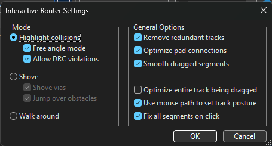
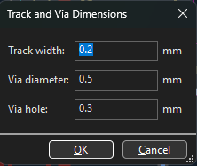
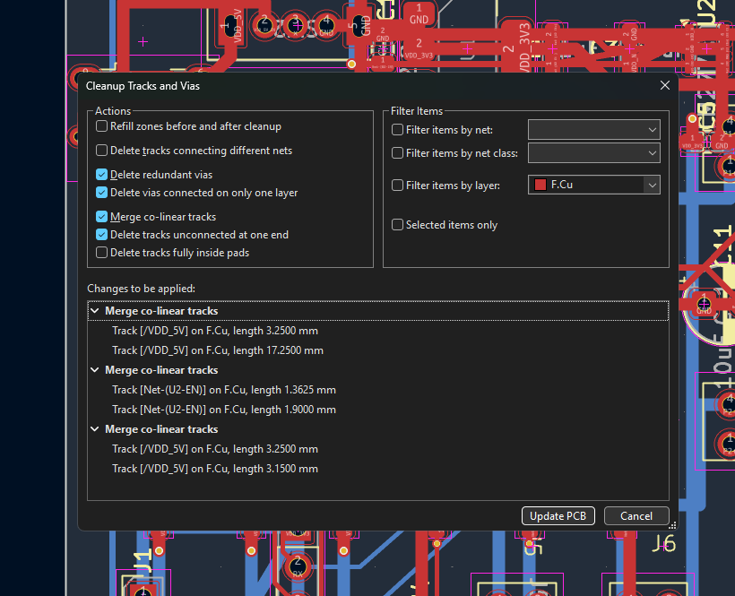
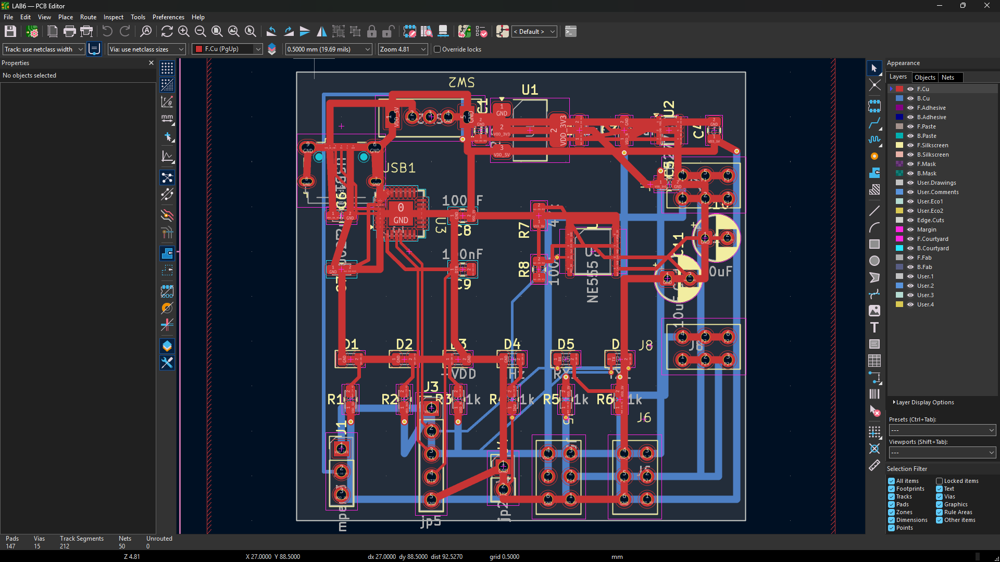
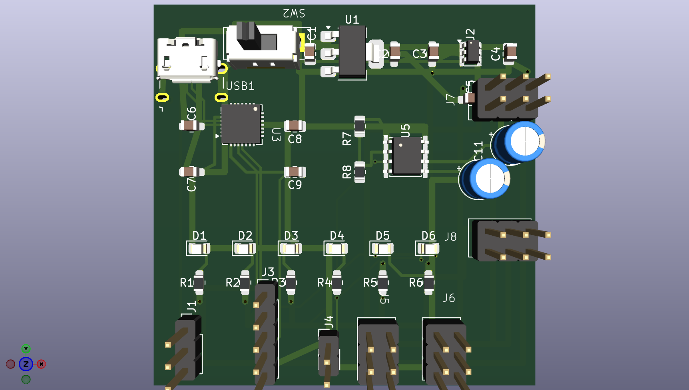
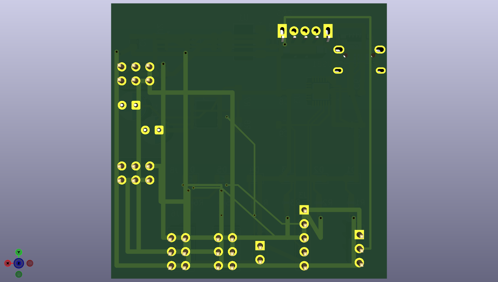
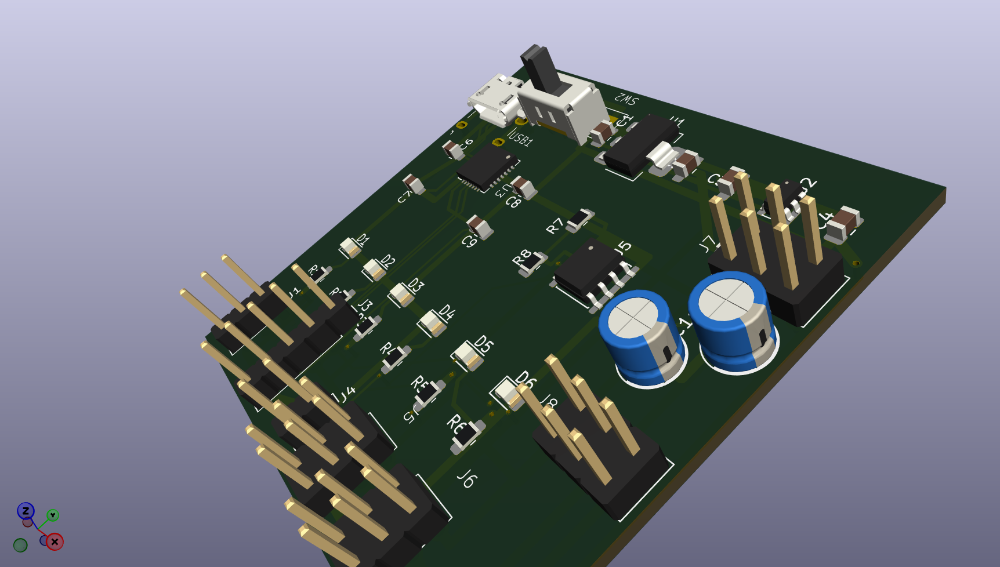

    

        
ĐẠI HỌC KHOA HỌC TỰ NHIÊN - ĐHQG TP.HCM KHOA ĐIỆN TỬ - VIỄN THÔNG

        

    

    
    

        
BÁO CÁO THỰC HÀNH

        
THIẾT KẾ MẠCH IN PCB VỚI KICAD

        
Lab 06: Routing – Kỹ thuật Đi dây Mạch in, Cấu hình Trình đi dây Tương tác và Quản lý Via

    

    
    

        <table class="student-info">
            <tr>
                <td>Họ và tên:</td>
                <td>Lê Ngọc Tường</td>
            </tr>
            <tr>
                <td>MSSV:</td>
                <td>23207124</td>
            </tr>
            <tr>
                <td>Lớp:</td>
                <td>23DTV_CLC3</td>
            </tr>
            <tr>
                <td>Môn học:</td>
                <td>Thiết kế mạch in PCB với KiCad (HK3/2025-2026)</td>
            </tr>
        </table>
    

    
    

        TP. HỒ CHÍ MINH, NĂM HỌC 2025 - 2026
    

## BÀI TẬP VỀ NHÀ: HOÀN THIỆN VÀ TỐI ƯU HÓA ROUTING TRÊN PCB CÁ NHÂN

**Yêu cầu:** Thực hiện định tuyến (Routing) toàn bộ mạng dây cho bo mạch cá nhân (Mạch nguồn đa năng USB - UART - NE555) đảm bảo đầy đủ các nguyên tắc kỹ thuật: phân bổ Net Classes (IPC-2152), cấu hình Trình đi dây tương tác (Interactive Router), uốn góc 45°, quản lý chuyển lớp via tối ưu, dọn dẹp mạch in (Cleanup) và vượt qua kiểm tra DRC (0 Errors, 0 Warnings).

---

### 1. Cấu hình Trình đi dây Tương tác (Interactive Router)

Trình đi dây tương tác trong KiCad 10 cho phép định tuyến đường mạch bán tự động với khả năng kiểm soát va chạm theo thời gian thực dựa trên hệ thống Design Rules (DRC).

* **Ba chế độ định tuyến chính (Router Modes):**
  * **Highlight Collisions:** Đi dây thủ công, tô sáng màu xanh lá cây cảnh báo khi vi phạm khoảng cách an toàn (clearance).
  * **Shove (Chế độ tiêu chuẩn áp dụng):** Tự động đẩy các đường mạch hoặc via xung quanh dạt sang bên để mở lối đi cho đường mạch mới mà vẫn đảm bảo tuyệt đối khoảng cách an toàn. Đối với vật cản cố định (pad linh kiện hoặc track bị khóa), đường dây sẽ tự động luồn lách qua.
  * **Walk Around:** Tự động ôm sát biên dạng ngoài của các vật cản để tìm đường đi ngắn nhất mà không làm xê dịch đối tượng khác.

    
    
Hình 1. Hộp thoại cấu hình Trình đi dây Tương tác (Interactive Router Settings) trong KiCad

* **Bảng thiết lập tối ưu hóa đi dây trong Interactive Router:**

<table class="report-table">
<thead>
<tr>
<th style="width: 25%;">Tùy chọn (Option)</th>
<th style="width: 45%;">Ý nghĩa kỹ thuật</th>
<th style="width: 30%;">Thiết lập áp dụng</th>
</tr>
</thead>
<tbody>
<tr>
<td><b>Mode</b></td>
<td>Chọn 1 trong 3 chế độ: Highlight collisions, Shove, Walk around</td>
<td><b>Shove</b> (để đi dây linh hoạt)</td>
</tr>
<tr>
<td><b>Shove vias</b></td>
<td>Cho phép đẩy via cùng với đường mạch khi phát sinh va chạm</td>
<td><b>Enabled</b> (tối ưu mật độ dây)</td>
</tr>
<tr>
<td><b>Jump over obstacles</b></td>
<td>Tự động nhảy vượt qua phía sau chướng ngại vật cố định</td>
<td><b>Enabled</b></td>
</tr>
<tr>
<td><b>Remove redundant tracks</b></td>
<td>Tự động xóa các vòng lặp (loops) dư thừa khi vẽ đường thay thế</td>
<td><b>Enabled</b> (chống tạo loop nhiễu)</td>
</tr>
<tr>
<td><b>Optimize pad connections</b></td>
<td>Tự động căn chỉnh hướng thoát dây ra khỏi pad, tránh góc nhọn</td>
<td><b>Enabled</b> (chống đứt gãy pad)</td>
</tr>
<tr>
<td><b>Smooth dragged segments</b></td>
<td>Làm mượt và gộp các đoạn dây khi kéo giãn để giảm số lần đổi hướng</td>
<td><b>Enabled</b></td>
</tr>
<tr>
<td><b>Allow DRC violations</b></td>
<td>Bỏ qua cảnh báo khoảng cách an toàn, cho phép đặt đè đường mạch</td>
<td><b>Disabled</b> (bảo đảm an toàn mạch)</td>
</tr>
</tbody>
</table>

### 2. Quy chuẩn Net Classes, Góc uốn 45° và Kỹ thuật Quản lý Via

#### 2.1. Tư thế đường mạch (Track Posture) và Góc uốn 45° (Corner Mode)
* **Tư thế đường mạch (Track Posture):** Sử dụng phím tắt **`/`** (*Switch Track Posture*) để đảo thứ tự ưu tiên giữa đoạn thẳng và đoạn chéo 45°.
* **Chế độ góc uốn 45°:** Sử dụng phím tắt **`Ctrl + /`** để thiết lập chế độ *45 degree*.
* **Nguyên tắc chống bẫy axit (Acid Traps) và giảm bức xạ EMI:** Toàn bộ đường mạch được vát góc 45° hoặc 135°, triệt tiêu tuyệt đối góc vuông 90° và góc nhọn (< 90°) nhằm ngăn chặn ứ đọng dung dịch ăn mòn hóa học gây đứt dây mạch và loại bỏ hiện tượng phát xạ nhiễu điện từ.

#### 2.2. Bảng phân bổ Net Classes và quy chuẩn bề rộng đường đồng (IPC-2152)

<table class="report-table">
<thead>
<tr>
<th style="width: 18%;">Tên Net Class</th>
<th style="width: 15%;">Độ rộng Track</th>
<th style="width: 15%;">Clearance</th>
<th style="width: 18%;">Via (Đường kính / Lỗ)</th>
<th style="width: 34%;">Các Net áp dụng & Chức năng</th>
</tr>
</thead>
<tbody>
<tr>
<td><b><code>Power_Main</code></b></td>
<td style="text-align: center; font-weight: bold;">0.80 mm</td>
<td style="text-align: center;">0.25 mm</td>
<td style="text-align: center;">0.80 / 0.40 mm</td>
<td><code>VBUS</code>, <code>+5V</code>, <code>+3.3V</code>, <code>-5V</code>, <code>GND</code> (Dòng tải lớn 1.0A-1.5A, chống sụt áp)</td>
</tr>
<tr>
<td><b><code>USB_Diff</code></b></td>
<td style="text-align: center; font-weight: bold;">0.30 mm</td>
<td style="text-align: center;">0.20 mm</td>
<td style="text-align: center;">0.60 / 0.30 mm</td>
<td><code>D+</code>, <code>D-</code> từ cổng Micro-USB (Cặp vi sai song hành, trở kháng vi sai 90 &Omega;)</td>
</tr>
<tr>
<td><b><code>Signal_UART</code></b></td>
<td style="text-align: center; font-weight: bold;">0.30 mm</td>
<td style="text-align: center;">0.20 mm</td>
<td style="text-align: center;">0.60 / 0.30 mm</td>
<td><code>TXD</code>, <code>RXD</code>, <code>RTS</code>, <code>CTS</code>, <code>DTR</code>, <code>CLK</code> (Tín hiệu logic 3.3V và xung NE555)</td>
</tr>
<tr>
<td><b><code>Default</code></b></td>
<td style="text-align: center; font-weight: bold;">0.40 mm</td>
<td style="text-align: center;">0.20 mm</td>
<td style="text-align: center;">0.60 / 0.30 mm</td>
<td>Các đường LED D1-D6, phân cực (Tín hiệu điều khiển chung trên bo mạch)</td>
</tr>
</tbody>
</table>

#### 2.3. Kỹ thuật Quản lý Via, Chuẩn bảo vệ IPC-4761 và Dọn dẹp mạch in (Cleanup)
* **Kỹ thuật chuyển lớp via:** Trong quá trình đi dây bằng lệnh **`X`**, nhấn phím **`V`** (*Place Via*) để chèn via xuyên lớp và chuyển đổi vùng làm việc giữa lớp mặt trên `F.Cu` và mặt dưới `B.Cu`.
* **Tiêu chuẩn bảo vệ Via (IPC-4761):** Áp dụng chế độ *Type I (Tenting)* phủ kín lớp mặt nạ hàn (Solder Mask) lên lỗ via chống oxy hóa; các via chịu dòng nguồn được tăng kích thước vành đồng lên 0.80 mm / lỗ 0.40 mm.
* **Dọn dẹp tối ưu hóa mạch in (Cleanup Tracks & Vias):** Chạy công cụ **Tools -> Cleanup Tracks & Vias...** để tự động gộp các đoạn thẳng hàng (*Merge co-linear tracks*), xóa các đoạn dây cụt bỏ lửng (*Delete tracks unconnected at one end*) và loại bỏ via trùng lặp (*Delete redundant vias*).

    
    
Hình 2. Hộp thoại cấu hình Track & Via Sizes

    
    
Hình 3. Hộp thoại Cleanup Tracks & Vias

### 3. Kết quả Thiết kế Bản vẽ 2D PCB Layout và Mô hình Phối cảnh 3D

Bo mạch nguồn đa năng kích thước 50 &times; 50 mm gồm 38 linh kiện và 29 nets đã được định tuyến hoàn chỉnh trên 2 lớp đồng (`F.Cu` và `B.Cu`), tích hợp đầy đủ khung bản vẽ Title Block chuẩn thông tin sinh viên.

#### 3.1. Bản vẽ Thiết kế 2D PCB Layout hoàn chỉnh

    
    
Hình 4. Bản vẽ 2D PCB Layout hoàn thiện (Lớp Top F.Cu màu đỏ, Lớp Bottom B.Cu màu xanh, Title Block cá nhân)

#### 3.2. Phối cảnh 3D Render trực quan của Bo mạch hoàn thiện

    
    
Hình 5. Phối cảnh 3D Mặt Trên (Top Layer F.Cu)

    
    
Hình 6. Phối cảnh 3D Mặt Dưới (Bottom Layer B.Cu)

    
    
Hình 7. Phối cảnh 3D Đa góc nhìn (Isometric View) thể hiện độ hoàn thiện thực tế của bo mạch Lab 06

### 4. Đánh giá Kiểm tra DRC và Chiến lược Tối ưu hóa Bo mạch

#### 4.1. Bảng Kiểm tra và Đánh giá Chất lượng Thiết kế

<table class="report-table">
<thead>
<tr>
<th style="width: 6%;">STT</th>
<th style="width: 32%;">Hạng mục kiểm tra</th>
<th style="width: 28%;">Tiêu chuẩn chất lượng</th>
<th style="width: 18%;">Kết quả thực tế</th>
<th style="width: 16%;">Đánh giá</th>
</tr>
</thead>
<tbody>
<tr>
<td style="text-align: center;">1</td>
<td><b>Tỷ lệ kết nối mạng (Ratsnest)</b></td>
<td>100% các net được kết nối (0 unrouted)</td>
<td style="text-align: center; font-weight: bold;">0 unconnected</td>
<td style="text-align: center; font-weight: bold; color: #16a34a;">ĐẠT (Passed)</td>
</tr>
<tr>
<td style="text-align: center;">2</td>
<td><b>Góc chuyển hướng đường mạch</b></td>
<td>Vát góc 45° / 135°, triệt tiêu góc 90°</td>
<td style="text-align: center;">100% góc 45°</td>
<td style="text-align: center; font-weight: bold; color: #16a34a;">ĐẠT (Passed)</td>
</tr>
<tr>
<td style="text-align: center;">3</td>
<td><b>Độ rộng đường nguồn (<code>Power_Main</code>)</b></td>
<td>Bề rộng dây &ge; 0.80 mm theo Net Class</td>
<td style="text-align: center;">0.80 mm trục nguồn</td>
<td style="text-align: center; font-weight: bold; color: #16a34a;">ĐẠT (Passed)</td>
</tr>
<tr>
<td style="text-align: center;">4</td>
<td><b>Cặp vi sai USB (<code>D+</code>, <code>D-</code>)</b></td>
<td>Đi song hành đối xứng, cách ly nhiễu tốt</td>
<td style="text-align: center;">Song hành, không via</td>
<td style="text-align: center; font-weight: bold; color: #16a34a;">ĐẠT (Passed)</td>
</tr>
<tr>
<td style="text-align: center;">5</td>
<td><b>Bố trí Tụ lọc nguồn & Bypass</b></td>
<td>Nguồn &rarr; Tụ lọc &rarr; Chân cấp IC</td>
<td style="text-align: center;">Tụ ôm sát chân IC</td>
<td style="text-align: center; font-weight: bold; color: #16a34a;">ĐẠT (Passed)</td>
</tr>
<tr>
<td style="text-align: center;">6</td>
<td><b>Khoảng cách mép bo (<code>Edge.Cuts</code>)</b></td>
<td>Khoảng cách đường đồng &ge; 0.50 mm</td>
<td style="text-align: center;">1.0 mm &ndash; 2.5 mm</td>
<td style="text-align: center; font-weight: bold; color: #16a34a;">ĐẠT (Passed)</td>
</tr>
<tr>
<td style="text-align: center;">7</td>
<td><b>Tối ưu hóa Via xuyên lớp</b></td>
<td>Via 0.8/0.4mm (Nguồn), 0.6/0.3mm (Tín hiệu)</td>
<td style="text-align: center;">Số lượng tối thiểu</td>
<td style="text-align: center; font-weight: bold; color: #16a34a;">ĐẠT (Passed)</td>
</tr>
<tr>
<td style="text-align: center;">8</td>
<td><b>Dọn dẹp mạch in (Cleanup)</b></td>
<td>Không stub thừa, không via cụt 1 đầu</td>
<td style="text-align: center;">Đã tối ưu hoàn toàn</td>
<td style="text-align: center; font-weight: bold; color: #16a34a;">ĐẠT (Passed)</td>
</tr>
</tbody>
</table>

#### 4.2. Chiến lược Tối ưu hóa và Bài học Kinh nghiệm

* **Quy hoạch phân tầng (Layer Stackup Strategy):**
  * Lớp trên `F.Cu`: Định tuyến các đường tín hiệu ngắn, kết nối trực tiếp các chân linh kiện dán SMD (AMS1117, CP2102, NE555).
  * Lớp dưới `B.Cu`: Phân phối các trục nguồn chính liên kết giữa các cọc Jumpers và Header, tạo hành lang thông thoáng để chuẩn bị cho việc phủ đồng mặt phẳng mass (*Ground Plane*) ở Lab 07.
* **Kỹ thuật chống nhiễu cho khối tạo xung NE555:** Tụ lọc phân cực 10 &mu;F và tụ bypass 100 nF đặt sát chân 8 (VCC) và chân 5 (CV) của NE555. Đường xung ngõ ra `CLK_555` được cách ly với các đường truyền dữ liệu vi sai USB để tránh gây nhiễu chéo (*Crosstalk*).
* **Tối ưu hóa phân tán nhiệt và dòng tải cho IC nguồn:** Đường mạch ngõ ra `+3.3V` của AMS1117-3.3V (U1) được mở rộng lên 0.80 mm, tạo vùng đệm đồng tản nhiệt tại Pad số 2 (Tab) nhằm nâng cao độ bền và ổn định nhiệt.
* **Quy trình kiểm soát chất lượng:** Luôn ưu tiên đi dây đường nguồn và cặp vi sai USB trước; tận dụng chế độ Shove để tối ưu hóa không gian; chạy Cleanup Tracks & Vias và kiểm tra DRC đạt 0 lỗi trước khi bàn giao thiết kế.
